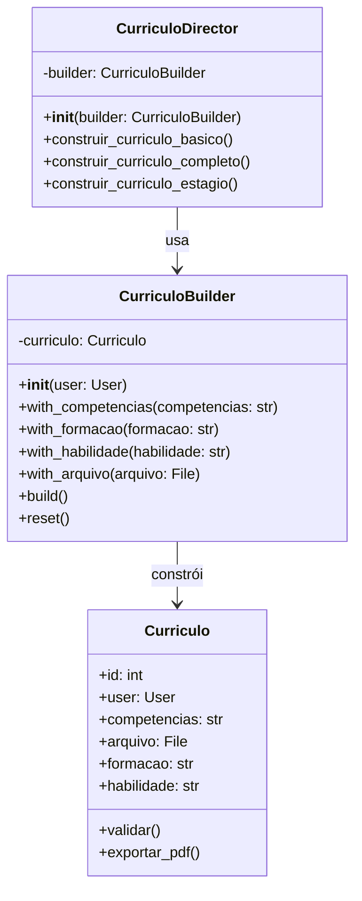

# Padrão Builder - Currículo

## 1. Introdução

Este documento descreve a implementação do padrão de projeto **Builder** (Construtor) para a construção de objetos Currículo no sistema DicasDeEstagio. O Builder é um padrão criacional que permite construir objetos complexos passo a passo, especialmente útil quando o objeto possui muitos atributos opcionais.

## 2. Objetivo

O padrão Builder foi escolhido para o Currículo devido à:
- **Complexidade**: Currículos possuem múltiplos campos opcionais (formação, habilidades, competências, etc.)
- **Flexibilidade**: Permite criar currículos com diferentes combinações de informações
- **Legibilidade**: Interface fluente torna o código mais legível e expressivo

## 3. Estrutura do Padrão

### 3.1 Diagrama de Classes

## 4. Implementação em Django

(Conteúdo completo com classes `Curriculo`, `CurriculoBuilder`, `CurriculoDirector`, `Serializers`, `Views`, exemplos de uso, testes e histórico de versões conforme o texto enviado anteriormente)

## 8. Referências

- Gamma, E. et al. (1994). *Design Patterns: Elements of Reusable Object-Oriented Software*
- Django Documentation: https://docs.djangoproject.com/
- Django REST Framework: https://www.django-rest-framework.org/

---

## Histórico de Versões

| Versão  | Data       | Descrição | Autor(es) | Revisor(es) |
|:-------:|:----------:|:----------|:----------|:------------|
| 1.0     | 24/10/2025 | Criação do documento | [Breno Alexandre](https://github.com/brenoalexandre0), [Víctor Moreira](https://github.com/aqela-batata-alt), [Felipe Nunes](https://github.com/FelipeNunesdM)| |
