# Padrão Composite - Instituição

## 1. Introdução

Este documento descreve a implementação do padrão de projeto **Composite** para representar a estrutura hierárquica de instituições de ensino no sistema DicasDeEstagio. O Composite é um padrão estrutural que permite compor objetos em estruturas de árvore para representar hierarquias parte-todo.

## 2. Objetivo

O padrão Composite foi escolhido para Instituições devido à:
- **Hierarquia natural**: Instituição → Departamento/Faculdade → Curso
- **Tratamento uniforme**: Operações aplicáveis a toda hierarquia
- **Flexibilidade**: Facilita adicionar novos níveis hierárquicos

## 3. Estrutura do Padrão

### 3.1 Diagrama de Classes

```mermaid

classDiagram
    class Instituicao {
        +id: int
        +nome: String
        +cnpj: String
        +AreaAtuacao: String
        +__str__() String
    }

    class ComponenteInstitucional {
        <<abstract>>
        +nome: String
        +get_nome() String
        +exibir(nivel: int) String
        +adicionar(componente) void
        +remover(componente) void
        +obter_filhos() List
        +contar_total_elementos() int
    }

    class InstituicaoComposite {
        +instituicao: Instituicao
        +get_nome() String
        +adicionar(componente) void
        +remover(componente) void
        +exibir(nivel: int) String
        +get_estrutura_json() Dict
    }

    class UnidadeComposite {
        +instituicao_composite: InstituicaoComposite
        +pai: UnidadeComposite
        +get_nome() String
        +adicionar(componente) void
        +remover(componente) void
        +exibir(nivel: int) String
        +get_estrutura_json() Dict
    }

    class CursoComposite {
        +unidade_composite: UnidadeComposite
        +get_nome() String
        +exibir(nivel: int) String
        +get_estrutura_json() Dict
    }

    Instituicao "1" -- "1" InstituicaoComposite : representa
    ComponenteInstitucional <|-- InstituicaoComposite
    ComponenteInstitucional <|-- UnidadeComposite
    ComponenteInstitucional <|-- CursoComposite
    InstituicaoComposite "1" *-- "many" UnidadeComposite : contém
    UnidadeComposite "1" *-- "many" CursoComposite : contém
    UnidadeComposite "1" *-- "many" UnidadeComposite : subunidades

```



## 4. Implementação em Django

### 4.1 Models (models.py)

```python

from django.db import models

# MODEL ORIGINAL - NÃO MODIFICADA
class Instituicao(models.Model):
    nome = models.CharField(max_length=255)
    cnpj = models.CharField(max_length=14)
    AreaAtuacao = models.CharField(max_length=255)

    def __str__(self):
        return self.nome

    class Meta:
        verbose_name = 'Instituição'
        verbose_name_plural = 'Instituições'

# PADRÃO COMPOSITE - IMPLEMENTAÇÃO SEPARADA
class ComponenteInstitucional(models.Model):
    """
    Classe base abstrata para o padrão Composite.
    """
    nome = models.CharField(max_length=255)
    
    class Meta:
        abstract = True
    
    def get_nome(self):
        return self.nome
    
    def exibir(self, nivel=0):
        raise NotImplementedError("Método abstrato")
    
    def adicionar(self, componente):
        raise NotImplementedError("Este componente não pode ter filhos")
    
    def remover(self, componente):
        raise NotImplementedError("Este componente não pode ter filhos")
    
    def obter_filhos(self):
        return []
    
    def contar_total_elementos(self):
        total = 1
        for filho in self.obter_filhos():
            total += filho.contar_total_elementos()
        return total


class InstituicaoComposite(ComponenteInstitucional):
    """
    Adaptador que implementa o Composite para Instituicao.
    """
    instituicao = models.OneToOneField(
        Instituicao,
        on_delete=models.CASCADE,
        related_name='composite'
    )
    
    class Meta:
        verbose_name = 'Instituição (Composite)'
        verbose_name_plural = 'Instituições (Composite)'
    
    def __str__(self):
        return f"Composite: {self.instituicao.nome}"
    
    def get_nome(self):
        return self.instituicao.nome
    
    def adicionar(self, componente):
        if isinstance(componente, UnidadeComposite):
            componente.instituicao_composite = self
            componente.save()
        else:
            raise TypeError("Instituição só pode conter Unidades")
    
    def remover(self, componente):
        if isinstance(componente, UnidadeComposite):
            componente.instituicao_composite = None
            componente.save()
    
    def obter_filhos(self):
        return list(self.unidades.filter(pai__isnull=True))
    
    def exibir(self, nivel=0):
        indentacao = "  " * nivel
        instituicao = self.instituicao
        resultado = f"{indentacao}🏛️ {instituicao.nome} (CNPJ: {instituicao.cnpj}, Área: {instituicao.AreaAtuacao})\n"
        
        for unidade in self.obter_filhos():
            resultado += unidade.exibir(nivel + 1)
        
        return resultado
    
    def get_estrutura_json(self):
        instituicao = self.instituicao
        return {
            'id': instituicao.id,
            'nome': instituicao.nome,
            'cnpj': instituicao.cnpj,
            'AreaAtuacao': instituicao.AreaAtuacao,
            'tipo': 'instituicao',
            'filhos': [unidade.get_estrutura_json() for unidade in self.obter_filhos()]
        }


class UnidadeComposite(ComponenteInstitucional):
    """
    Componente composto para unidades/departamentos.
    """
    instituicao_composite = models.ForeignKey(
        InstituicaoComposite,
        on_delete=models.CASCADE,
        related_name='unidades',
        null=True,
        blank=True
    )
    pai = models.ForeignKey(
        'self',
        on_delete=models.CASCADE,
        related_name='subunidades',
        null=True,
        blank=True
    )
    
    class Meta:
        verbose_name = 'Unidade (Composite)'
        verbose_name_plural = 'Unidades (Composite)'
    
    def __str__(self):
        return self.nome
    
    def adicionar(self, componente):
        if isinstance(componente, CursoComposite):
            componente.unidade_composite = self
            componente.save()
        elif isinstance(componente, UnidadeComposite):
            componente.pai = self
            componente.save()
        else:
            raise TypeError("Unidade só pode conter Cursos ou Subunidades")
    
    def remover(self, componente):
        if isinstance(componente, CursoComposite):
            componente.unidade_composite = None
            componente.save()
        elif isinstance(componente, UnidadeComposite):
            componente.pai = None
            componente.save()
    
    def obter_filhos(self):
        cursos = list(self.cursos.all())
        subunidades = list(self.subunidades.all())
        return subunidades + cursos
    
    def exibir(self, nivel=0):
        indentacao = "  " * nivel
        resultado = f"{indentacao}📁 {self.nome}\n"
        
        for filho in self.obter_filhos():
            resultado += filho.exibir(nivel + 1)
        
        return resultado
    
    def get_estrutura_json(self):
        return {
            'id': self.id,
            'nome': self.nome,
            'tipo': 'unidade',
            'filhos': [filho.get_estrutura_json() for filho in self.obter_filhos()]
        }


class CursoComposite(ComponenteInstitucional):
    """
    Componente folha para cursos.
    """
    unidade_composite = models.ForeignKey(
        UnidadeComposite,
        on_delete=models.CASCADE,
        related_name='cursos'
    )
    
    class Meta:
        verbose_name = 'Curso (Composite)'
        verbose_name_plural = 'Cursos (Composite)'
    
    def __str__(self):
        return self.nome
    
    def exibir(self, nivel=0):
        indentacao = "  " * nivel
        return f"{indentacao}📚 {self.nome}\n"
    
    def obter_filhos(self):
        return []
    
    def get_estrutura_json(self):
        return {
            'id': self.id,
            'nome': self.nome,
            'tipo': 'curso',
            'filhos': []
        }
```

### 4.2 Serializers (serializers.py)

```python
from rest_framework import serializers
from .models import Instituicao, Unidade, Curso

class CursoSerializer(serializers.ModelSerializer):
    """Serializer para Curso (Leaf)"""
    
    class Meta:
        model = Curso
        fields = ['id', 'nome', 'unidade']


class UnidadeSerializer(serializers.ModelSerializer):
    """Serializer para Unidade (Composite)"""
    cursos = CursoSerializer(many=True, read_only=True)
    subunidades = serializers.SerializerMethodField()
    
    class Meta:
        model = Unidade
        fields = ['id', 'nome', 'instituicao', 'pai', 'cursos', 'subunidades']
    
    def get_subunidades(self, obj):
        """Serializa subunidades recursivamente"""
        subunidades = obj.subunidades.all()
        return UnidadeSerializer(subunidades, many=True).data


class InstituicaoSerializer(serializers.ModelSerializer):
    """Serializer para Instituição (Root Composite)"""
    unidades = UnidadeSerializer(many=True, read_only=True)
    total_elementos = serializers.SerializerMethodField()
    
    class Meta:
        model = Instituicao
        fields = ['id', 'nome', 'cnpj', 'AreaAtuacao', 'unidades', 'total_elementos']
    
    def get_total_elementos(self, obj):
        """Conta total de elementos na hierarquia"""
        return obj.contar_total_elementos()


class InstituicaoHierarquiaSerializer(serializers.ModelSerializer):
    """
    Serializer especializado para exibir hierarquia completa.
    Usa o método get_estrutura_json do padrão Composite.
    """
    estrutura = serializers.SerializerMethodField()
    
    class Meta:
        model = Instituicao
        fields = ['id', 'nome', 'cnpj', 'AreaAtuacao', 'estrutura']
    
    def get_estrutura(self, obj):
        """Retorna estrutura hierárquica completa"""
        return obj.get_estrutura_json()
```


### 4.3 Views (views.py)

```python
from rest_framework import viewsets, status
from rest_framework.decorators import action
from rest_framework.response import Response
from rest_framework.permissions import IsAuthenticatedOrReadOnly
from django.db.models import Prefetch
from .models import Instituicao, Unidade, Curso
from .serializers import (
    InstituicaoSerializer,
    InstituicaoHierarquiaSerializer,
    UnidadeSerializer,
    CursoSerializer
)

class InstituicaoViewSet(viewsets.ModelViewSet):
    """
    ViewSet para gerenciar instituições.
    Implementa operações do padrão Composite.
    """
    queryset = Instituicao.objects.all()
    serializer_class = InstituicaoSerializer
    permission_classes = [IsAuthenticatedOrReadOnly]
    
    def get_queryset(self):
        """Otimiza queries com prefetch"""
        return Instituicao.objects.prefetch_related(
            'unidades',
            'unidades__cursos'
        )
    
    @action(detail=True, methods=['get'], url_path='hierarquia')
    def hierarquia(self, request, pk=None):
        """
        Retorna estrutura hierárquica completa da instituição.
        """
        instituicao = self.get_object()
        serializer = InstituicaoHierarquiaSerializer(instituicao)
        return Response(serializer.data)
    
    @action(detail=True, methods=['get'], url_path='exibir')
    def exibir_estrutura(self, request, pk=None):
        """
        Retorna representação textual da hierarquia.
        """
        instituicao = self.get_object()
        estrutura_texto = instituicao.exibir()
        
        return Response({
            'instituicao': instituicao.nome,
            'estrutura': estrutura_texto
        })
    
    @action(detail=True, methods=['post'], url_path='adicionar-unidade')
    def adicionar_unidade(self, request, pk=None):
        """
        Adiciona uma unidade à instituição usando método do Composite.
        """
        instituicao = self.get_object()
        
        serializer = UnidadeSerializer(data=request.data)
        serializer.is_valid(raise_exception=True)
        
        # Criar unidade
        unidade = Unidade(**serializer.validated_data)
        
        # Usar método adicionar do Composite
        instituicao.adicionar(unidade)
        
        return Response(
            UnidadeSerializer(unidade).data,
            status=status.HTTP_201_CREATED
        )


class UnidadeViewSet(viewsets.ModelViewSet):
    """
    ViewSet para gerenciar unidades.
    Suporta operações de composição.
    """
    queryset = Unidade.objects.all()
    serializer_class = UnidadeSerializer
    permission_classes = [IsAuthenticatedOrReadOnly]
    
    def get_queryset(self):
        """Otimiza queries"""
        return Unidade.objects.prefetch_related(
            'cursos',
            'subunidades'
        ).select_related('instituicao', 'pai')
    
    @action(detail=True, methods=['post'], url_path='adicionar-curso')
    def adicionar_curso(self, request, pk=None):
        """
        Adiciona um curso à unidade.
        """
        unidade = self.get_object()
        
        serializer = CursoSerializer(data=request.data)
        serializer.is_valid(raise_exception=True)
        
        # Criar curso
        curso = Curso(**serializer.validated_data)
        
        # Usar método adicionar do Composite
        unidade.adicionar(curso)
        
        return Response(
            CursoSerializer(curso).data,
            status=status.HTTP_201_CREATED
        )
    
    @action(detail=True, methods=['post'], url_path='adicionar-subunidade')
    def adicionar_subunidade(self, request, pk=None):
        """
        Adiciona uma subunidade.
        """
        unidade_pai = self.get_object()
        
        serializer = UnidadeSerializer(data=request.data)
        serializer.is_valid(raise_exception=True)
        
        subunidade = Unidade(**serializer.validated_data)
        unidade_pai.adicionar(subunidade)
        
        return Response(
            UnidadeSerializer(subunidade).data,
            status=status.HTTP_201_CREATED
        )


class CursoViewSet(viewsets.ModelViewSet):
    """
    ViewSet para gerenciar cursos.
    Cursos são folhas na hierarquia (não têm filhos).
    """
    queryset = Curso.objects.all()
    serializer_class = CursoSerializer
    permission_classes = [IsAuthenticatedOrReadOnly]
    
    def get_queryset(self):
        """Otimiza queries"""
        return Curso.objects.select_related(
            'unidade',
            'unidade__instituicao'
        )
```
## 5. Exemplo de Uso

### 5.1 Construindo a Hierarquia

```python
# Usando a model original (não modificada)
instituicao = Instituicao.objects.create(
    nome="Universidade de Brasília",
    cnpj="12345678000195", 
    AreaAtuacao="Ensino Superior"
)

# Criando o composite (opcional)
composite = InstituicaoComposite.objects.create(
    instituicao=instituicao,
    nome=instituicao.nome
)

# A instituição original continua funcionando normalmente
print(instituicao.nome)  # "Universidade de Brasília"
print(instituicao.cnpj)  # "12345678000195"

# O composite adiciona funcionalidades extras
print(composite.exibir())
```

### 5.2 Requisições API

```bash
# Listar instituições
GET /api/instituicoes/

# Ver hierarquia completa
GET /api/instituicoes/1/hierarquia/

# Exibir estrutura textual
GET /api/instituicoes/1/exibir/

# Adicionar departamento
POST /api/instituicoes/1/adicionar-departamento/
{
    "nome": "Faculdade de Tecnologia",
    "codigo": "FT",
    "descricao": "Faculdade de cursos tecnológicos"
}

# Adicionar curso a departamento
POST /api/departamentos/1/adicionar-curso/
{
    "nome": "Engenharia de Software",
    "codigo": "ES",
    "nivel": "graduacao",
    "duracao": 10
}

# Ver caminho completo do curso
GET /api/cursos/1/caminho-completo/
```

## 6. Vantagens da Implementação

- ✅ **Uniformidade**: Trata objetos individuais e composições de forma uniforme
- ✅ **Recursividade**: Operações funcionam recursivamente na hierarquia
- ✅ **Flexibilidade**: Fácil adicionar novos níveis hierárquicos
- ✅ **Manutenibilidade**: Estrutura clara e organizada
- ✅ **Navegação**: Facilita navegação na árvore de componentes

## 7. Testes

```python
from django.test import TestCase
from .models import Instituicao, Unidade, Curso

class CompositeInstituicaoTestCase(TestCase):
    
    def setUp(self):
        """Configura hierarquia de teste"""
        self.unb = Instituicao.objects.create(
            nome='Universidade de Brasília',
            cnpj='12345678000195',
            AreaAtuacao='Ensino Superior'
        )
        
        self.fga = Unidade.objects.create(
            nome='Faculdade do Gama',
            instituicao=self.unb
        )
        
        self.curso = Curso.objects.create(
            nome='Engenharia de Software',
            unidade=self.fga
        )
    
    def test_adicionar_unidade(self):
        """Testa adição de unidade"""
        nova_unidade = Unidade(
            nome='Faculdade de Tecnologia'
        )
        self.unb.adicionar(nova_unidade)
        
        self.assertEqual(nova_unidade.instituicao, self.unb)
    
    def test_contar_elementos(self):
        """Testa contagem de elementos na hierarquia"""
        total = self.unb.contar_total_elementos()
        self.assertEqual(total, 3)  # UnB + FGA + Curso
    
    def test_exibir_hierarquia(self):
        """Testa exibição da hierarquia"""
        estrutura = self.unb.exibir()
        self.assertIn('Universidade de Brasília', estrutura)
        self.assertIn('Faculdade do Gama', estrutura)
        self.assertIn('Engenharia de Software', estrutura)
    
    def test_instituicao_str(self):
        """Testa representação string da instituição"""
        self.assertEqual(str(self.unb), 'Universidade de Brasília')
    
    def test_unidade_str(self):
        """Testa representação string da unidade"""
        self.assertEqual(str(self.fga), 'Faculdade do Gama')
    
    def test_curso_str(self):
        """Testa representação string do curso"""
        self.assertEqual(str(self.curso), 'Engenharia de Software')
```

## 8. Referências

- Gamma, E. et al. (1994). Design Patterns: Elements of Reusable Object-Oriented Software
- Django Documentation: https://docs.djangoproject.com/
- Django REST Framework: https://www.django-rest-framework.org/

---

## Histórico de Versões

| Versão  | Data       | Descrição | Autor(es) | Revisor(es) |
|:-------:|:----------:|:----------|:----------|:------------|
| 1.0     | 24/10/2025 | Criação do documento | [Breno Alexandre](https://github.com/brenoalexandre0), [Víctor Moreira](https://github.com/aqela-batata-alt), [Felipe Nunes](https://github.com/FelipeNunesdM)| |
