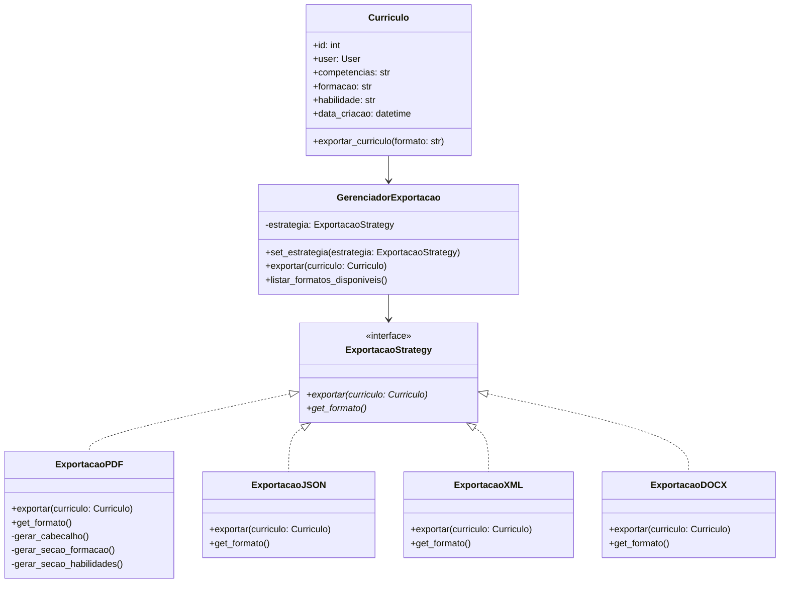

# Padrão Strategy - Currículo (Exportação)

## 1. Introdução

Este documento descreve a implementação do padrão de projeto **Strategy** para o sistema de exportação de currículos no **DicasDeEstagio**.  
O **Strategy** é um padrão comportamental que permite definir uma família de algoritmos, encapsulá-los e torná-los intercambiáveis.

---

## 2. Objetivo

O padrão **Strategy** foi escolhido para a exportação de currículos devido à:

- **Múltiplos formatos:** Necessidade de exportar currículos em PDF, JSON, XML, DOCX  
- **Flexibilidade:** Adicionar novos formatos sem modificar código existente  
- **Separação de responsabilidades (concerns):** Isolar a lógica de exportação do modelo de currículo

---

## 3. Estrutura do Padrão

### 3.1 Diagrama de Classes

---

## 4. Considerações Finais

A aplicação do padrão **Strategy** neste contexto promove **extensibilidade** e **baixo acoplamento**.  
Cada formato de exportação é encapsulado em sua própria classe, permitindo a evolução do sistema sem a necessidade de alterar o código existente do **GerenciadorExportacao** ou da classe **Curriculo**.

---

**Autor:** Equipe DicasDeEstagio  
**Data:** Outubro de 2025
